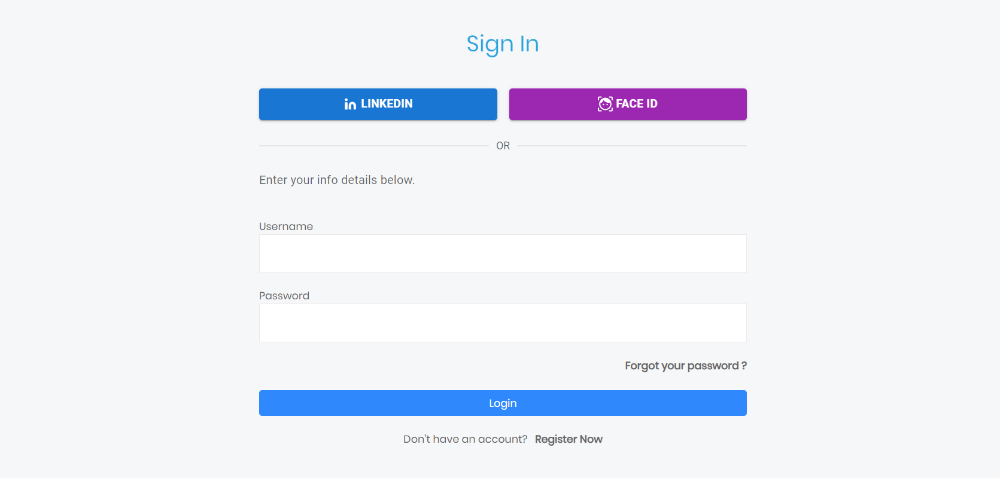

# Medical Assistant

Medical Assistant is an **AI-powered healthcare system** that helps patients **find suitable doctors** based on symptoms, location, and provider schedules. It uses AI to match users with doctors, allows them to rate providers, and includes a chatbot for **immediate assistance** and **appointment booking**. Patient **medical records are stored** securely with **blockchain** technology, allowing authorized healthcare providers to access them while **ensuring privacy and security**. This system centralizes medical services and schedules in a single dashboard, providing a comprehensive view for resource management and a seamless patient experience.


## Main Features

- Symptom Detection Module
- Appointment Scheduling System
- Blockchain-Based Medical Records
- Chatbot for Patient Interaction
- User Authentication and Identity Verification
- Real-time Reporting Dashboard

## Tech Stack Used

- Symptom Detection Module: **Python**, **Flask**
- Appointment Scheduling System: **Node.js**, **Express.js**, **MongoDB**
- Blockchain-Based Medical Records: **Blockchain**
- Chatbot for Patient Interaction: **Node.js**, **Express.js**
- User Authentication and Identity Verification: **Advanced authentication(facial recognition)**
- Real-time Reporting Dashboard: **React.js**, **MongoDB**


## Application Design

## 

## Run on your Device

#### Prerequisites
You may find below the list of things you need to use this project :

Make sure MongoDB is running on your system.
You will need to install the "npm" command line.
Make Sure Python downloaded.

Clone the project from the repository
```bash
  git clone https://github.com/vaibhavi-singh-673/Medical-Assist.git
```

Install dependencies

Start the server
```bash
  cd server/
  npm install --force
```

```bash
  npm run server
```

Start the Client
```bash
  cd react-app/
  npm install --force
```

```bash
  npm run start
```

Start Blockchain
```bash
  cd blockchain/
  npm install --force
```

```bash
  npm run node_1
```
Start python
```bash
  cd py side/
```
```bash
  python run.py
```

## ScreenShots

#### Home Page

## 

#### Authentication and ID verification

## 
## 
## 

#### Symptoms Detection and Suggestions

## 
## 

#### Appointments

## 

#### Contact Us

## 

#### Chat Bot

## 


- Made by [@vaibhavi-singh-673](https://github.com/vaibhavi-singh-673)